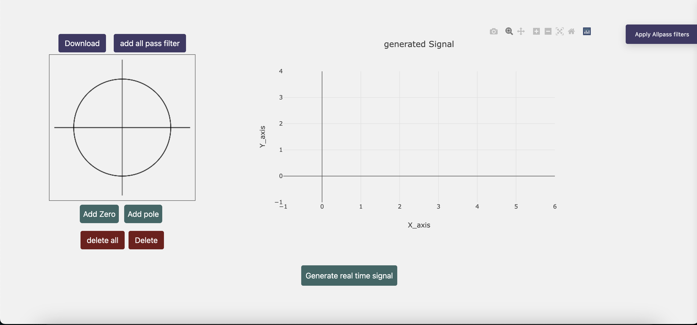
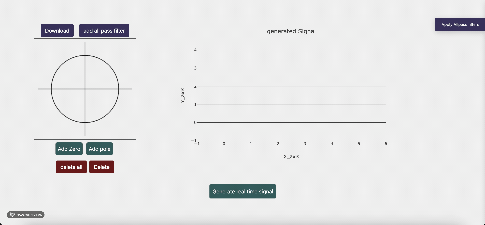
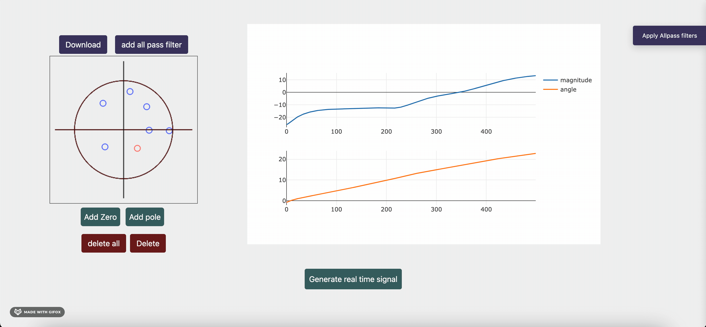
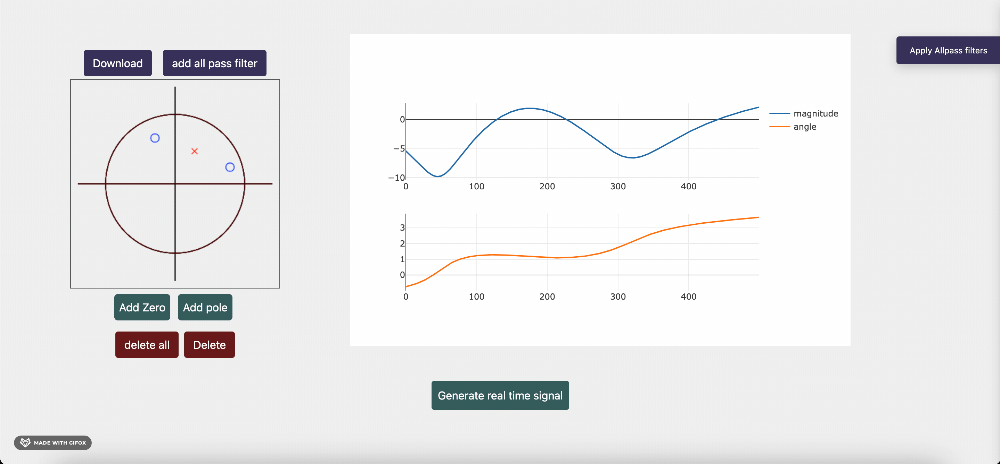
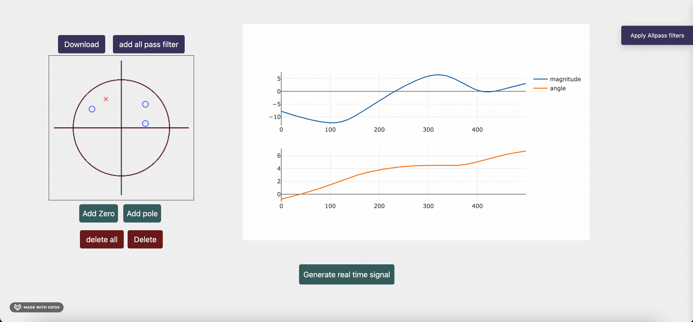
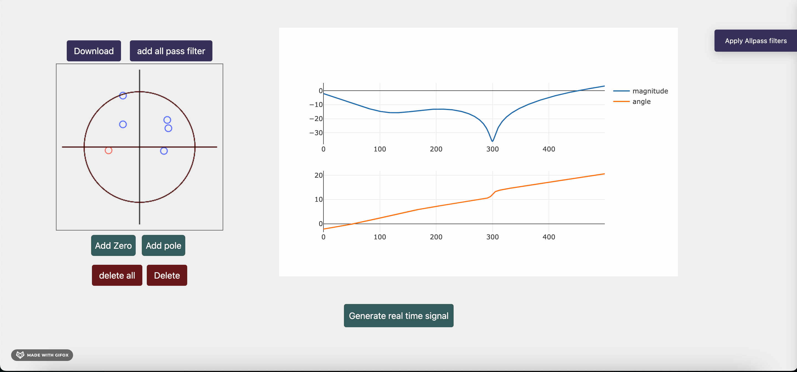
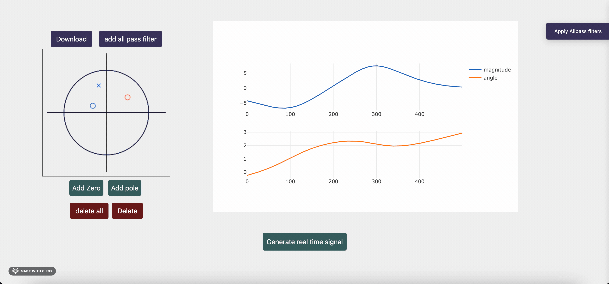
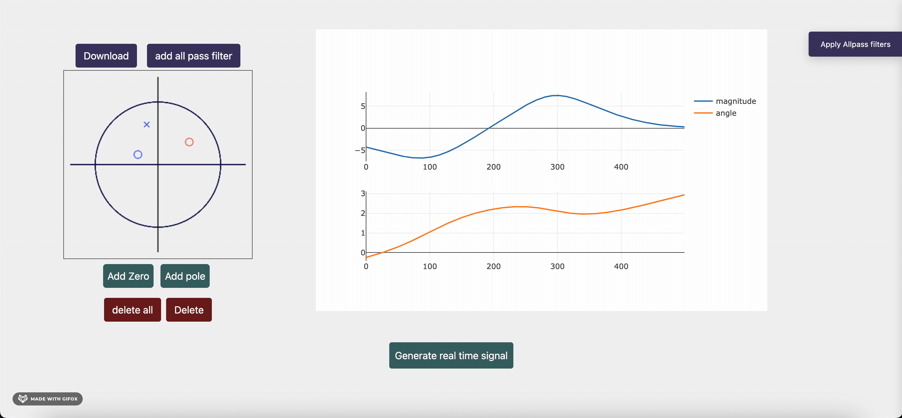

# Digital filter designer

A website that helps users to design a custom digital filter via zeros-poles placement on the z-plane.

## Table of Contents

- [Deployment](#Deployment)
- [Design](#Design)
- [Features](#Features)

## Deployment
 Clone


 Install flask
```bash
  pip install flask
```
To start deployment 
```bash
  flask run
```

## 🖌️ Design



## Features
1. Add zeros



2. Add poles



3. Modify the placed zeros/poles by dragging them



4. Click on a zero or pole and delete it



5. Delete all zeros and poles



6. Correct for the phase by adding some All-Pass filters



7. Enable/disable the added all-pass elements



8. Generate signal to test your filter 


     All rights reserved © 2022 to Team 21 - Systems & Biomedical Engineering, Cairo University (Class 2024)
